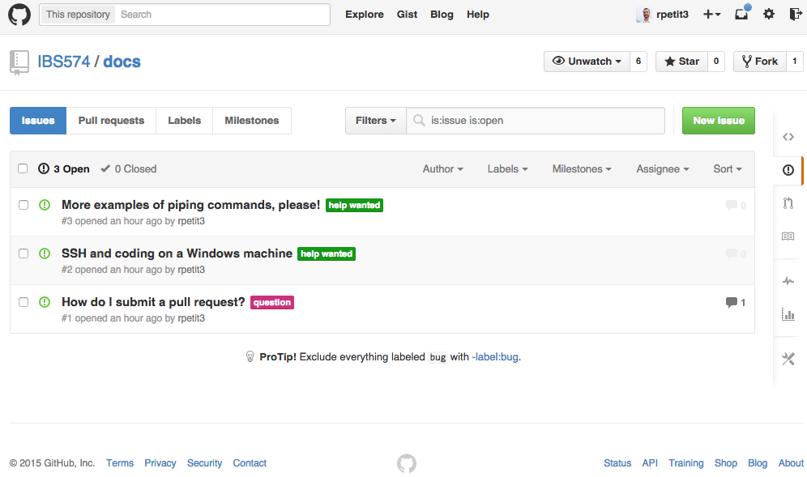
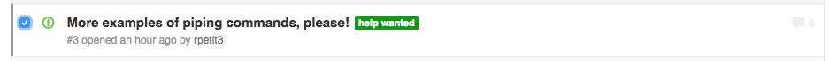
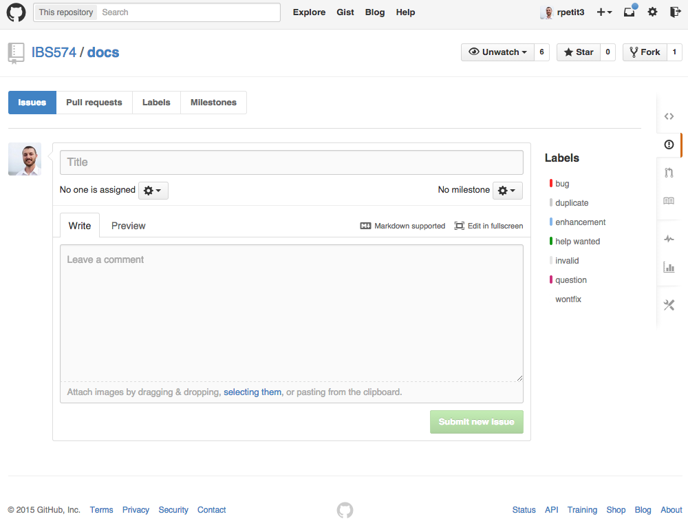
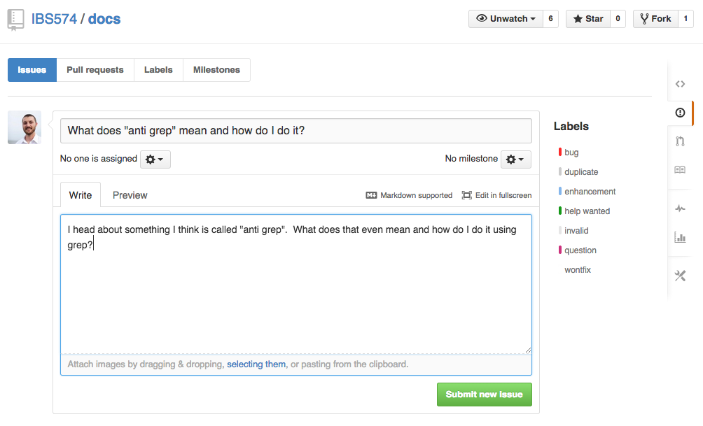

# The Complete Guide to IBS574
Welcome to the complete (or not so complete at the moment!) guide to IBS574! By
the end of IBS574 we will have covered a number of topics ranging from basic
UNIX commands to complex bioinformatic algorithms. In order to make life a
little easier for everyone, this site will act as a broad resource of topics
covered in class.  For example, basic tutorials for SSHing in to the EIGC
server or turning in your homework through a pull request on Github will be
available from this site.

## Driven by the Class
Probably the best benefit that can come from this guide, is you as a class can
drive what topics are covered in this guide and even make your own
contributions! Consider this a social experiment, at a minimum it will include
topics from class but it really has the potential to grow into a valuable
resource for not only this class but also future classes.

## Stuck? Want more info? Need a tutorial?
The cool thing about using GitHub is we can use the built in **_Issues_**
system to submit requests for things to be added to this guide. People can
comment on the requests, offer their opinions, suggest solutions and even add
those solutions to the guide!

## Submitting a Request
Let's say you are stuck on a homework question. The question is asking you to
use pipes to create a string of commands and redirect STDERR to STDOUT. There
were a few examples of pipes from lecture, but you still have some questions
and would like some clarification.

Let's use GitHub to submit a request for a short tutorial! Follow these steps!

1. Go to the [IBS574 Docs - Issues Page](https://github.com/IBS574/docs/issues)
2. You should be at a page that looks something like this:

3. Is there something like you are requesting already there?
    * If yes, let's comment on the request and add anything that might be missing.
        1. In this case there is already something similar to what we are
           requesting. Its this one:
        
        2. If you click on the issue it will [open the details about the issue.](https://github.com/IBS574/docs/issues/3)
        
        3. Add your comments, and finally click **_Comment_**
        
        4. *Voila!* You are done, emails should have been sent and TAs will take a look!

    * If no, let's create a new request!
        1. Go to the [IBS574 Docs - New Issue Page](https://github.com/IBS574/docs/issues/new)
        
        2. Fill in the details, add lables, finally click **_Submit new issue_**
        
        3. *Voila!* You are done, your request has been added to the list.
        Also, emails should have been sent and TAs will take a look!
        
